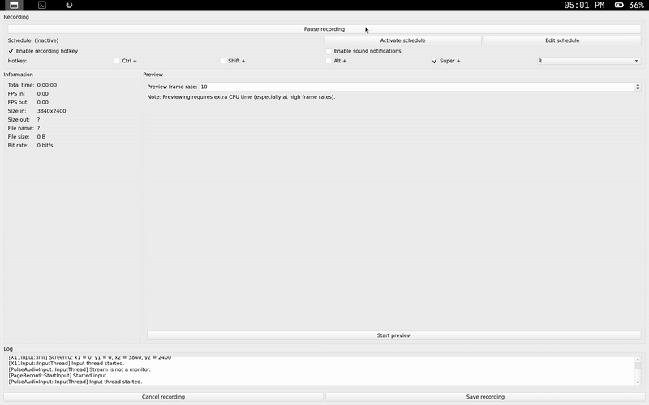

# Monowm 🙉

Lightweight window manger for x that uses under 3mb of ram. This window manager follows the mobile workflow where one app/window always occupies the entire screen.



## How to install

### Dependencies

#### Build Dependencies
Install the required tools and X11 development headers for your distribution:

**Arch-based:**
```bash
sudo pacman -S base-devel libx11 pkgconf
```

**Debian/Ubuntu-based:**
```bash
sudo apt update && sudo apt install build-essential libx11-dev pkg-config
```

**Fedora-based:**
```bash
sudo dnf groupinstall "Development Tools" && sudo dnf install libX11-devel pkgconf-pkg-config
```

**NixOS:**
You can use the provided [shell.nix](shell.nix) to enter a development shell with all build dependencies:
```bash
nix-shell
```

#### Xorg Server (Required Runtime)
Since `monowm` is an X11 window manager, you will need the Xorg server and `xinit` (for `startx`) installed:

**Arch-based:**
```bash
sudo pacman -S xorg-server xorg-xinit
```

**Debian/Ubuntu-based:**
```bash
sudo apt update && sudo apt install xserver-xorg xinit
```

**Fedora-based:**
```bash
sudo dnf install xorg-x11-server-Xorg xinit
```

**NixOS:**
Enable the X11 windowing system in your `/etc/nixos/configuration.nix`:
```nix
services.xserver.enable = true;
```

#### Optional Runtime Dependencies
These are recommended for the default configuration:
* [alacritty](https://github.com/alacritty/alacritty) (default terminal)
* [alttab](https://github.com/sagb/alttab) (to switch tabs)
* [dmenu](https://tools.suckless.org/dmenu/) (to launch applications)
* [pipewire](https://pipewire.org/) (for volume control)
* [brightnessctl](https://github.com/Hummer12007/brightnessctl) (to control screen brightness)
* [dunst](https://github.com/dunst-project/dunst) (to see volume changes and low battery notifications)
* [lemonbarxft](https://github.com/drscream/lemonbar-xft) (Built-in bar)
* A Nerd Font of your choice (for the bar icons)

### Installation Steps
1. Clone the repository:
   ```bash
   git clone https://github.com/dantevazquez/monowm.git
   cd monowm
   ```
2. Build and install:
   ```bash
   make install
   # Or on NixOS: nix-shell --run "make install"
   ```
3. Run `startx` or launch from your favorite display manager.

## Default Binds

| Keybinding | Action / Command | Config Option / Keybind Command |
| :--- | :--- | :--- |
| `super+q` | Close active window | `bind_quit` |
| `super+Tab` | Cycle windows (native switcher, disabled by default) | `bind_cycle` |
| `super+Shift + [1-9]` | Focus window 1-9 | `bind_switch_window_mod` |
| `super+Shift+r` | Reload configuration | `bind_reload` |
| `super+Shift+b` | Toggle status bar visibility | `bind_toggle_bar` |
| `super+Return` | Launch terminal (`alacritty`) | `keybind = super+Return : alacritty` |
| `super+space` | Launch app launcher (`dmenu`) | `keybind = super+space : dmenu_run -fn 'monospace-14'` |
| `super+b` | Launch browser (`chromium`) | `keybind = super+b : chromium` |
| `XF86AudioRaiseVolume` | Increase volume | `keybind = XF86AudioRaiseVolume : ~/.local/bin/monowm-volume up` |
| `XF86AudioLowerVolume` | Decrease volume | `keybind = XF86AudioLowerVolume : ~/.local/bin/monowm-volume down` |
| `XF86AudioMute` | Mute/unmute volume | `keybind = XF86AudioMute : ~/.local/bin/monowm-volume mute` |
| `XF86AudioMicMute` | Mute/unmute microphone | `keybind = XF86AudioMicMute : wpctl set-mute @DEFAULT_AUDIO_SOURCE@ toggle` |
| `XF86MonBrightnessUp` | Increase brightness | `keybind = XF86MonBrightnessUp : ~/.local/bin/monowm-brightness up` |
| `XF86MonBrightnessDown` | Decrease brightness | `keybind = XF86MonBrightnessDown : ~/.local/bin/monowm-brightness down` |

## Configuration
* Core configurations (bindings, custom hotkeys, auto-run commands) can be configured in `~/.config/monowm/config.conf` (see template: [config.conf](templates/config.conf)).
* Additional startup configuration and display setttings can be customized in `~/.config/monowm/autostart` (see default: [autostart](autostart)).
* Bar configuration can be configured in `~/.config/monowm/bar.conf` (see template: [bar.conf](templates/bar.conf)).
